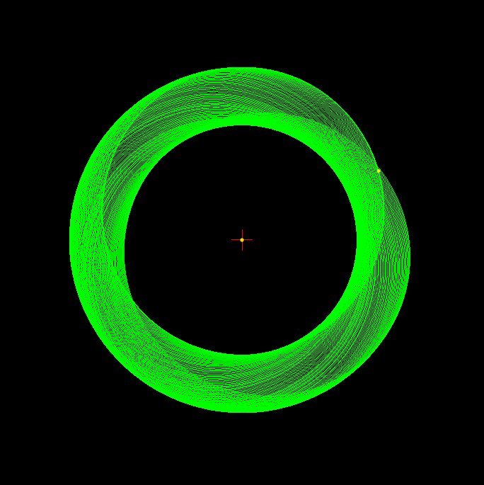
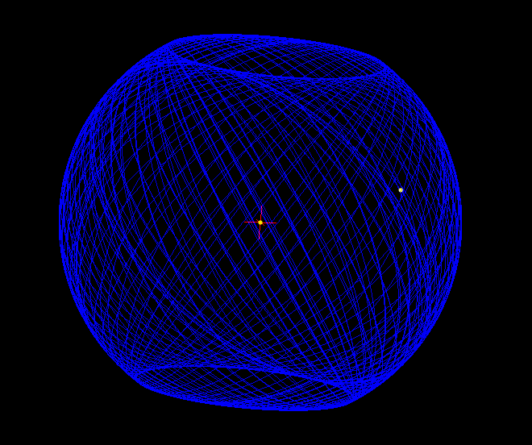

.. REBOUNDx documentation master file, created by
   sphinx-quickstart on Sun Nov 29 14:22:27 2019.
   You can adapt this file completely to your liking, but it should at least
   contain the root `toctree` directive.

Welcome
=======

REBOUNDx (eXtras) allows you to easily incorporate additional physics into your REBOUND N-body integrations.
The main documentation to refer back to is the :ref:`effects` page.
Each effect links to both a Python and C example demonstrating its use.
If you are using REBOUNDx for the first time check out the quickstart guides below with installation instructions.

If you clone the repository at `https://github.com/dtamayo/reboundx <https://github.com/dtamayo/reboundx>`_ you can load and run all the jupyter notebook examples locally (under reboundx/ipython_examples) as well as the C examples (under reboundx/examples. 
In the terminal you can run the example in each folder with ``make clean && make && ./rebound``). 

Also see the 'saving and loading simulations' examples for how to save a REBOUNDx binary with effects and parameters.
For an overview of the technical details and some practical recommendations, see `Tamayo, Rein, Shi and Hernandez (2019) <https://arxiv.org/abs/1908.05634>`_.

Get Started!
------------

REBOUNDx is written in C, but we also provide a convenient Python wrapper (that's just as fast).

:ref:`python_quickstart`

:ref:`c_quickstart`

Attribution
-----------

If you find this code useful in your research, we have tried to structure the :ref:`effects` documentation in a way that makes it easy to credit the various people who have contributed, and for others to reproduce your results. 

For example 'We incorporated a constant time-lag model of tides \\citep{Hut81} using the \\textt{tides_constant_time_lag} implementation (Baronett et al., {\\em in prep.}) in {\\textsc \\tt REBOUNDx 3.1.0} \\citep{Tamayo19}.
The relevant such ADS links for each effect are provided in :ref:`effects`.

Contribute
----------

REBOUNDx is a flexible framework for including new effects.
You worry about incorporating the physics, and REBOUNDx takes care of how various effects should interact with the different integrators in REBOUND.
:ref:`add_effect` provides a tutorial on how to do that.

Please consider contributing your effects, so we can continue to build up an efficient and well-tested repository.
The documentation structure in :ref:`effects` makes it easy for people to cite your particular implementation!

Issues
------

I am always happy to answer questions or otherwise help out.
If you have problems, please open an issue on the GitHub page at `https://github.com/dtamayo/reboundx <https://github.com/dtamayo/reboundx>`_

.. toctree::
    :numbered:
    :hidden:

    effects
    python_quickstart
    c_quickstart
    c_api
    c_examples
    add_effect
