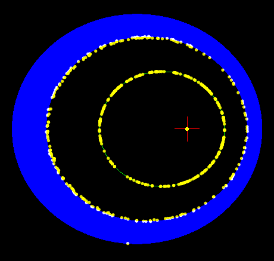

.. REBOUNDx documentation master file, created by
   sphinx-quickstart on Sun Nov 29 14:22:27 2015.
   You can adapt this file completely to your liking, but it should at least
   contain the root `toctree` directive.

Welcome to REBOUNDx (2.3.5)
===========================

.. image:: images/hlTau.png
   :width: 200px
   :height: 200px
   :align: right
.. image:: images/GR.png
   :width: 200px
   :height: 200px
   :align: right
.. image:: images/nodePrecession.png
   :width: 200px
   :height: 200px
   :align: right

REBOUNDx (eXtras) allows you to easily incorporate additional physics into your REBOUND simulations.
All the computationally expensive parts of the code are written in C, so that the code will run much faster than if you define your own custom ``additional_forces`` functions in Python.

So far we include:

* General relativity corrections
* Semimajor axis and eccentricity damping, implemented as forces
* Direct modifications to particles' orbital elements after each timestep
* Radiation Forces

It provides a general and easily extendable framework for including other effects, so please contact me
(tamayo.daniel@gmail.com) if you'd like to work on a new modification
and I can help you incorporate it (or even better send me a pull
request!)

Get Started!
------------

What version would you like to use?  
If you are unsure, I recommend you try out the Python version, as it enables you to simulate, analyze and plot everything all in one place.  
It also allows for a less verbose interface.
You'll find installation instructions in the links below.

Issues
------

If you have problems, please check out the :ref:`faq` page for possible answers, as well as for how to contact us for help!

:ref:`c_version`

:ref:`python_version`

Table of Contents
-----------------
.. toctree::
    :numbered:

    self
    modules
    c_version
    c_examples
    python_version
    ipython_examples
    faq

Indices and tables
==================

* :ref:`genindex`
* :ref:`search`

